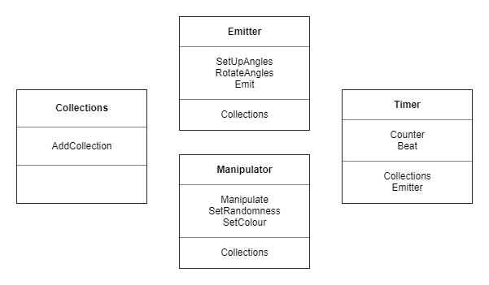
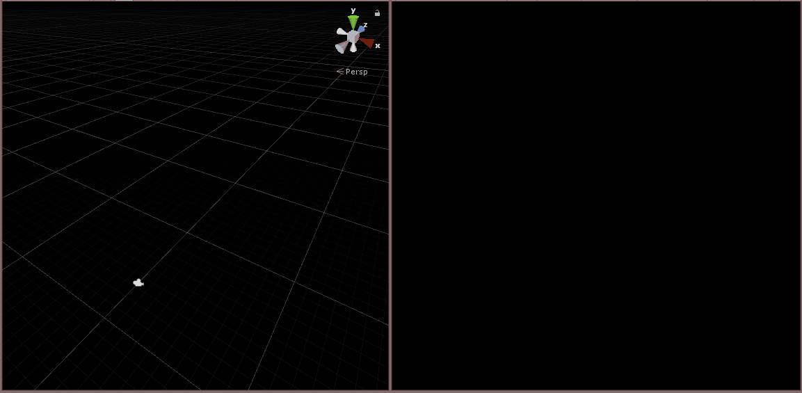

# APPROACH

## Session 01

**To do**
- Set up repo
- Write spec
- Write starting user stories

**Done**
- Set up repo
- Write spec
- Write starting user stories

## Session 02

**25 July 2019 15:09:38 - 25 July 2019 15:37:02**

**To do**
- Set up unity project to deploy to phone as vr app
    - Generate ossig file
    - Test build
- Write first test


**Done**
- Generated ossig file and placed it in the new plugins directory
- Tried deploying but getting errors that I think are to do with the Unity version. Downloading the same one used on Hide and Go Beetroot.
- Read some documentation on testing in Unity

## Session 03

**25 July 2019 15:41:34 - Thu Jul 25 16:14:19 DST 2019**

**To do**
- Restart Unity project with different version
- Set up project as vr
- Deploy to headset

**Done**
- Restart Unity project with different version
- Got the same build error:
```
FormatException: Input string was not in a correct format....
```
- Googled it, recommended to update android sdk
- Working!
- touched a .gitignore file, because Unity makes alot of temp things I don't want to commit
- looked up how to add whole folders, hopefully it will work
- missed the library temp files, will have to add those to ignore and remove tracking
```
git rm -r --cached .
```
- committed sans temp files

## Session 04

**Thu Jul 25 16:37:55 DST 2019 - Thu Jul 25 17:56:46 DST 2019**

**To do**
- Change scene to no lighting
- Test camera is present
- Design document

**Done**
- Researching no lighting set up but no good results
- Removing any lighting settings I can find in the settings and scene
- Researched anisotropic texturing. Since I think I will just use flat material colours in this project, I'll disable it.
- Disabled shadows
- Added a grid as reference in the scene
- Built to test
- Resized grid items
- Installed Oculus integration package for in-editor playtesting
- That didn't have the editor emulator I expected, installed googleVR package instead
- Couldn't install only the parts I wanted without breaking dependencies, so going to try and do without.
- Deployed to test nothing broke
- Resized grid points again
- Enabled 2x antialiasing
- Deployed to judge grid

## Session 05

**Fri 26 Jul 2019 15:36:25 - Fri 26 Jul 2019 16:52:04**

**To do**
- Write and run a test in Unity

**Done**
- Wrote three tests in Play mode but they don't test the current scene
- Tried to find out why, went down a rabbit hole of Data Oriented Design

## Session 06

**28 July 2019 13:16:38 - 28 July 2019 13:46:21**

**To do**
- Edit spec to remove testing
- Design document
- First emitter

**Done**
- Removed testing
- Started a new scene
- Reimported googleVR package for editor emulator
- Added googleVR package to gitignore
- Created a navel, intended to be the main emitter of the mandala
- Calculates the angles between emissions on the navel

## Session 07

**28 July 2019 14:02:56 - Sun Jul 28 15:25:32**

**To do**
- First emitter
    - Add simple movement to point
    - Repeat emission at interval

**Done**
- Prefab emitted at interval angle
- Added simple movement to point
- Found workflow (not ideal) for making gifs on windows
- Found a better workflow (downloaded a screen to gif programme)


## Session 08

**Sun Jul 28 20:25:32 - Sun Jul 28 21:07:42**

**To do**
- Simple motion of player through space
    - Add a script to move whichever way the camera is looking
    - Attach the navel to move with the gaze

**Done**
- Tried moving camera directly but had to attach it to a parent and move that
- Tried having the parent rotate with the child but that added them together into a spin
- Added the grid back for better spatial awareness
- Added adjustable speeds to the player, emitter, and points


## Session 09

**Mon 29 Jul 2019 14:58:00 - Mon 29 Jul 2019 15:49:54**

**To do**
- Make grid created relative to player
- Make player look change move direction

**Done**
- Downloaded and imported the googleVR package  from
[googleVR](https://github.com/googlevr/gvr-unity-sdk/releases) since I excluded it from the repo.
- Made the camera copy the player location with a simple script
- Edited the googleVR script to let the camera move, by commenting out lines 219 and 234
- Made the player copy the camera rotation with a simple script
- The points do not inherit their initial layout rotation from the navel
- Hit a blocker on this, not sure how to more proceed. Tried inverting vector3.forward from world space to local but that didn't work.

## Session 10

**Mon 29 Jul 2019 16:05:14 - Mon 29 Jul 2019 17:21:06**

**To do**
- Look inside vector3.forward, see if I can recreate it relative to parent

**Done**
- Vector3.forward never changes, it's just a common vector. WRONG it doesn't change because the script is on a child, which stays at 0 rotation!
- Still not working. Tempted to roll back movement to always be in a straight line
- Finally fixed it. I was overwriting the rotation, rather than rotating.
- Changed the emission interval implementation
- Emission angles rotate around the center
- Realised can just turn off the copy rotation script on the player to make movement linear, if I want to at different times in the game.


## Session 11

**Tue 30 Jul 2019 16:17:23 - Tue 30 Jul 2019 17:29:55**

**To do**
- Test leaving a trail instead of generating grid points
- Make a timer and visual indication of duration

**Done**
- Changed naming of point to particle
- Added a simple point prefab
- Added point emitter to navel
- Trying to update adb and android studio so I can deploy again
- Added gif to show previous session progress
- Trying Android File Transfer reinstall
- Trying android software update
- Trying Mac update
- Made a timer script
- Renamed navel to emitter
- Plan refactor of timings away from emitter to timer


## Session 12

**Tue 30 Jul 2019 18:14:14 - Tue 30 Jul 2019 19:31:57**

**To do**
- Refactor to timer
- Design document

**Done**
- Be annoyed at mac not recognising phone, even though adb lists it as a connected device
- Specified device in Unity build
- Deployed but not camera isn't moving with player, may have to go back to parenting it
- Remove points emission, looks crap when the camera doesn't move the emitter
- Added a coroutine to the particles to kill themselves after specified life in seconds
- Refactored to have a beats method on timer trigger the emissions on Emitter
- Simplified scene to remove anything related to the emitter rotating with player look

## Session 13

**Wed Jul 31 16:52:46 DST - Wed Jul 31 18:37:01**

**To do**
- Design document
    - Visual indicator of time progress?
    - Split length into three sections (bars)
    - Collects each beat's emissions into array
    - Play with collections colours and speed
    - Emit from emissions

**Done**
- Updated readme
- Got frustrated at having nowhere to draw, looking up buying a sheet of mdf and blackboard paint
- Tried throwing an error if time is not a multiple of 3, but it doesn't stop the program.
- Defaulted length in seconds to 3
- Decided on interactivity: The further away the player's gaze is from the emitter, the more random the variations of the particles. Updated readme.
- Updated CRC model



- Started implementing new classes but emitter stops after first beat
- Was calling a new method by mistake
- Adds each set of particles to a list, then add that list to a list
- Couldn't find an answer to the question of Unity lists being ordered or not, so I wrote this method to test it:
```
    void testinglists() // are lists ordered?
    {
        List<int> numbers = new List<int>();
        for(int i = 0; i < 10; i+=3)
        {
            numbers.Add(i);
        }
        foreach(int x in numbers)
        {
            Debug.Log(x);
        }
    }
```
Which gave the result:
```
0
3
6
9
```
and confirmed that they are.
- Added a link to this document in the README.
- Update CRC model

## Session 14

**Thu Aug  1 12:59:30 - Thu Aug  1 14:01:45**

**To do**
- Randomise each beat colour
    - for every particle
    - for the collection
    - for alternating particles

**Done**
- Little refactor of timer, towards SRP, and Player and Collector and Manipulator, deleting redundant lines
- Each collection has it's colour chosen from a list



## Session 15

**Thu Aug  1 14:12:53 - Thu Aug  1 15:23:38**

**To do**
- Choose colours randomly
- Give every particle it's own colour

**Done**
- Unity gui acting weird so reset computer
- Made a gif of colour changer
- Choose colours randomly
- Assign colours by all/individual/alternating


## Session 16

**Fri Aug  2 11:10:59 - Fri Aug  2 11:50:07**

**To do**
- Apply colour chooser to all beats

**Done**
- Recovered missing gif from previous commit on github
- Passed length into the manipulator
- Tried using length to calculate which switch to use, no good
- Loops through switches

## Session 17

**Fri Aug  2 11:59:59 - Fri Aug  2 13:16:50**

**To do**
- Make randomising tiers
- Make meshes in blender
- Import to Unity
- Name them
- Change manipulator behaviour based on tier

**Done**
- Plan randomiser/input class


- Started trying to read rotation values and go from there, probably better to implement raycast gaze for interaction
- Raycast sets tier string based on what is being looked at
- Made nice tier meshes with visual points to indicate them


## Session 18

**Fri Aug  2 13:35:13 - Fri Aug  2 14:00:59**

**To do**
- Plan effects of different tiers

**Done**
- Plan effects of different tiers


## Session 19

**Mon Aug  5 10:43:36 - Mon Aug  5 11:14:08**

**To do**
- Add scale change logic

**Done**
- Add scale change logic


## Session 20

**Mon Aug  5 11:31:46 - Mon Aug  5 12:06:49**

**To do**
- Add velocity change logic
- Plan timescale attributes

**Done**
- Add velocity change logic


- Plan timescale attributes


## Session 21

**Mon Aug  5 12:13:27 - Mon Aug  5 12:55:02**

**To do**
- Add particle direction change logic
- Add a small trail from tiers for more movement feeling

**Done**
- Was going to add a vector to rotation but just trying to rotate like the emitter does
- That works, tuned the values so it isn't too extreme.
- Trail is created but killed too soon, will have to give it it's own script
- Rotated trail points to prevent visual overlap with tiers


## Session 22

**Mon Aug  5 13:29:39**

**To do**
- Make tiers change patterns

**Done**
- Tiers change number of particles each emitted beat
- Tiers change which manipulator switch is used
- Tuned the numbers of particles
- Further BME design


- Randomised number of particles emitted within each of tier

## Session 23

**Tue Aug  6 11:24:38 - Tue Aug  6 12:29:20**

**To do**
- Refactor manipulator

**Done**
- Refactor manipulation
    - Extracted manipulation logic from selection logic, to make it reusable
    - Moved selection logic to Collector
    - Decreased interval between emissions


## Session 24

**Tue Aug  6 15:49:38 - Tue Aug  6 16:43:21**

**To do**
- Implement BME


**Done**
- BME on timer changes emitter number at each stage, stops emission after four stages
- Stages affect colour

## Session 25

**Wed Aug  7 09:57:36 - Wed Aug  7 10:43:38**

**To Do**
- Add start/restart loop
- Update CRC model
- Refactor

**Done**
- Added start/restart loop, but it isn't very well structured. Needs a decent refactor.


## Session 26

**Wed Aug  7 10:55:21 - Wed Aug  7 13:00:48**

**To do**
- Hide and reveal tiers

**Done**
- Joined tier points together for easier manipulation
- Turned them on and off with Timer
- Fiddled for ages setting up the color ping pong lerp on the tier points
- Made the lerps into coroutines to prevent stack overflow
- Turned ring on and off
- Made trail from it's own model rather than edit the tiers model
- The reticule shrinks back to size if it is outside the ring


- Changed the size of tier_0 for easier viewing

## Session 27

**To do**
- Update CRC model
- Refactor