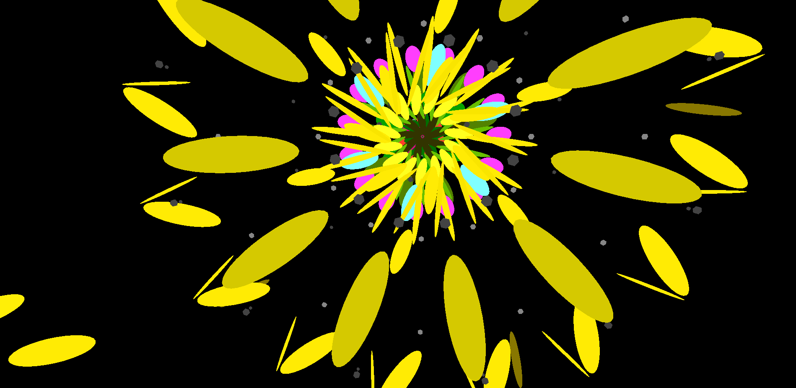

# MANDALA-COASTER


## A virtual reality fly-through, generated at each play with abstract shapes.
## The purpose of this project is to practice C# and my development process. Please read the [APPROACH](./APPROACH.md) file for documentation, and look in the [Scripts](./mandala-coaster/Assets/Scripts/) folder for the implementation I have written.

## GAMEPLAY
The player has a degree of influence on the generation: if they focus on the center that the particles emit from, there will be no variation in pattern. 

As their gaze moves away from the center, they introduce more randomness into the pattern. 

If they look too far away, the pattern deconstructs into chaos.

The experience last for 120 seconds.

---

DEMO


---

## HOW TO USE

- Transfer the [mandala-coaster_V1.0.apk](./mandala-coaster_V1.0.apk) file to an android device compatible with a GearVR headset. 
- Open the file on the device to install it. 
- Run the game and insert the device into the headset to play.
- Inside the game, look inside the ring to start the pattern generator.

---

## USER STORIES

```
I want to view a short colourful animated pattern that is different each time.
```
```
I want it to have a beginning, middle and end.
```
```
I want it to react to me.
```


## SPECIFICATION

It needs to be entertaining over repeat viewings.

It needs to be mildly interactive, responding to user input.

It needs to be written in C#, and teach me more about OOP.

It needs to be extendable with more features(sound).

## STRETCH FEATURES

```
I want sound to be generated too.
```
